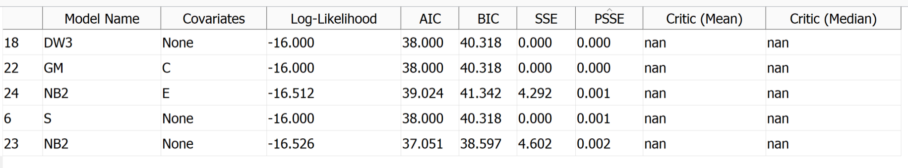
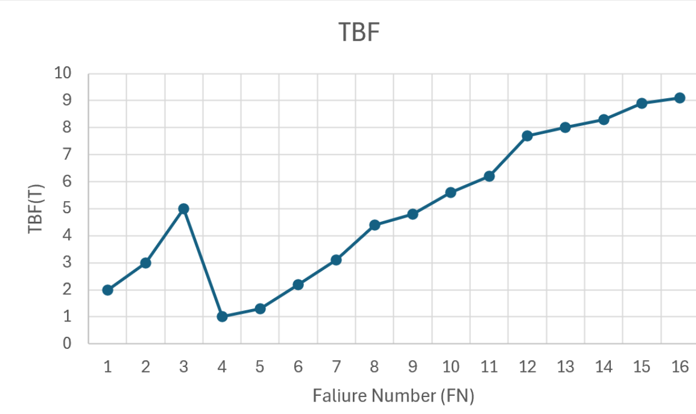
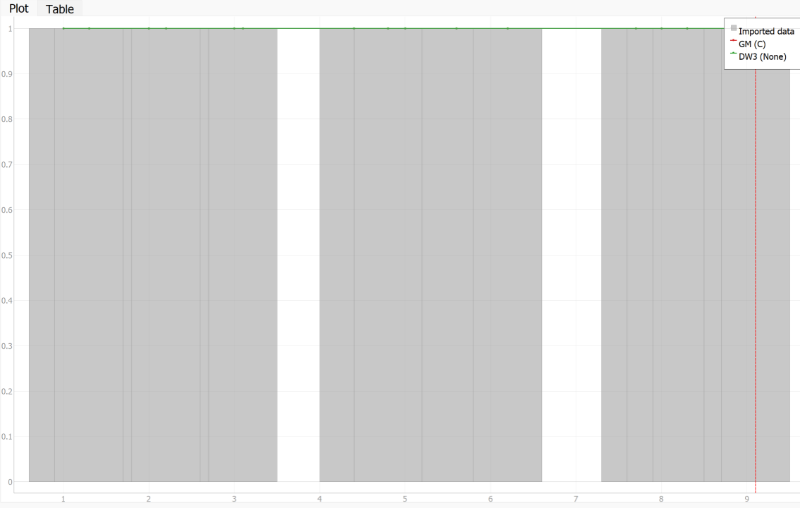

**SENG 438- Software Testing, Reliability, and Quality**

**Lab. Report \#5 – Software Reliability Assessment**

| Group \#:     2  |   |
|-----------------|---|
| Student Names:  |   |
|            Said Rahmani     |   |
|            Qasim Amar     |   |
|              Ahmed Abdullah
Muhammad Bilal   |   |

# Introduction
In this assignment, we explore two  techniques for assessing software reliability, Reliability Growth Testing and Reliability Demonstration Chart (RDC). The objective is to evaluate the reliability of a system using failure data collected during  testing. For Part 1, we use C-SFRAT to analyze failure trends, estimate failure rates, and predict system reliability. In Part 2, we apply RDC-11 which is an Excel-based tool, to determine whether the system meets a target Mean Time To Failure (MTTF). By comparing these two approaches, we are able to understand their strengths and limitations.
# 

# Assessment Using Reliability Growth Testing 

# Assessment Using Reliability Demonstration Chart 

The above image displays the plot for MTTFmin. 

The above image displays the plot for MTTFhalf. 

The above image displays the plot for MTTFdouble. 

# Explain your evaluation and justification of how you decide on the MTTFmin
We calculated our MTTFmin using our max acceptable number of failiures divided by input event when observed which was our cumulative execution time in hours converted to seconds. So we got 16/286,560 = 0.000055.

# Comparison of Results
Our Best 2 models are DW3 with none Covariates and GM with C Covariates because they have the lowest PSSE followed by the lowest SSE which are the top 2 most imporatant metrics when considering models performance. Even though their AIC is a little higher than NB2 and S but because PSSE and SSE are more imporant than AIC thats why NB2 and S arent in the top 2 

For MTTFmin the reliability trend displayed shows it partially in the reject area so it doesn't seem very reliable for FIO. The calculation for MTTF, in this case, is 16/286,560, which gives an MTTF of 0.000055. For MTTFhalf. The reliability trend displayed shows it in the reject area so it doesn't seem reliable at all for FIO. The calculation for MTTF, in this case, is 8/286,560, which gives an MTTF of 0.000028. For MTTFdouble. As plotted, the reliability trend suggests that the trend is acceptable for our FIO as it can be seen clearly that it isnt in the reject range. The calculation for MTTF, in this case, is 32/286,560, which gives an MTTF of 0.0001.

# Discussion on Similarity and Differences of the Two Techniques
  Similarities:
    - Both use graphical plots
    - Both aim to evaluate whether the software is reliable 
    - Both techniques rely on failure data collected during testing

  Differences:
     - RGT requires detailed failure intervals and execution time whereas RDC only needs failure counts and times
     - RGT uses statistical models growth over time wheras RDC is a pass/fail method that checks if observed failures meet a         predefined MTTF withing a certain range

# How the team work/effort was divided and managed
We divided the assignment between pairs of two. The first pair was responsible for doing part 1 which was the reliability growth testing and the other pair worked on part 2 which was the reliability demonstration chart. Upon completion we got together and showed our progress and explained what we did so everyone could leave with an understanding for the whole assignment. Lastly, the report was worked on by all team members in order for equal contribution.

# Difficulties encountered, challenges overcome, and lessons learned
Upon starting the assignment we had to overcome some difficulties as it was pretty confusing to begin with. Just understanding the datasets and how to use the tools took time to understand but with some trial and error we were able to complete the tasks. Since one of the group members had a Mac we made sure to join calls so they could still contribute and learn. A difficulty we faced when using RDC was that there wasn'y many resources online to follow along, so we had to play around with it and use trial and error to figure out how to use the excel sheet. Overall we were able to learn how to use software tools to read intensity and reliabilty graphs and visualize the reliability of a system.

# Comments/feedback on the lab itself
The biggest issue we saw with the lab was a lack of intstructions on how to use the tools. A lot of time went into trying to figure out how to use the new tools without much clarity. Having to go back and forth between adjusting the dataset took time. With the use of the tools, multiple sets of graph were generated and having some instructions on how to interpret those graphs would have been helpful.
