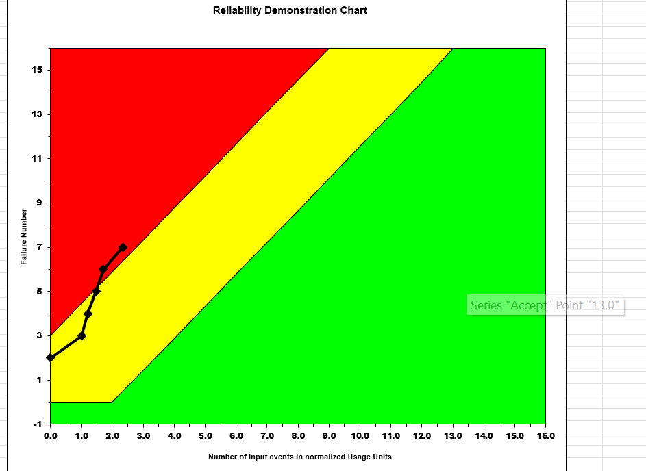
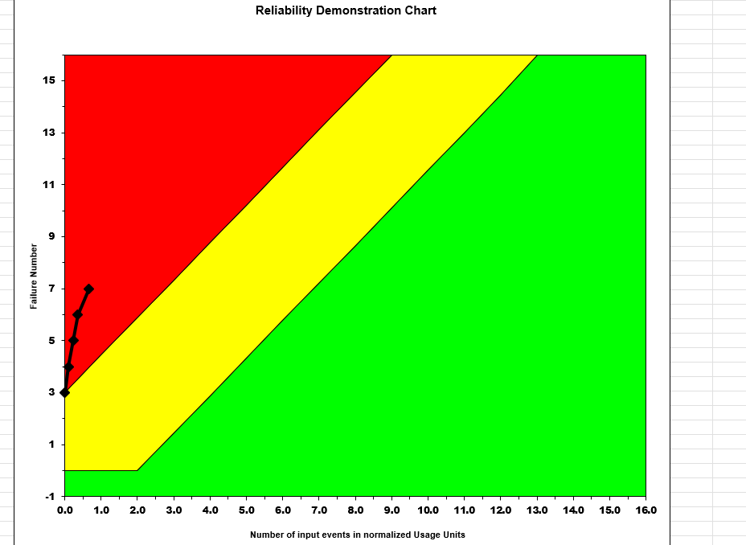
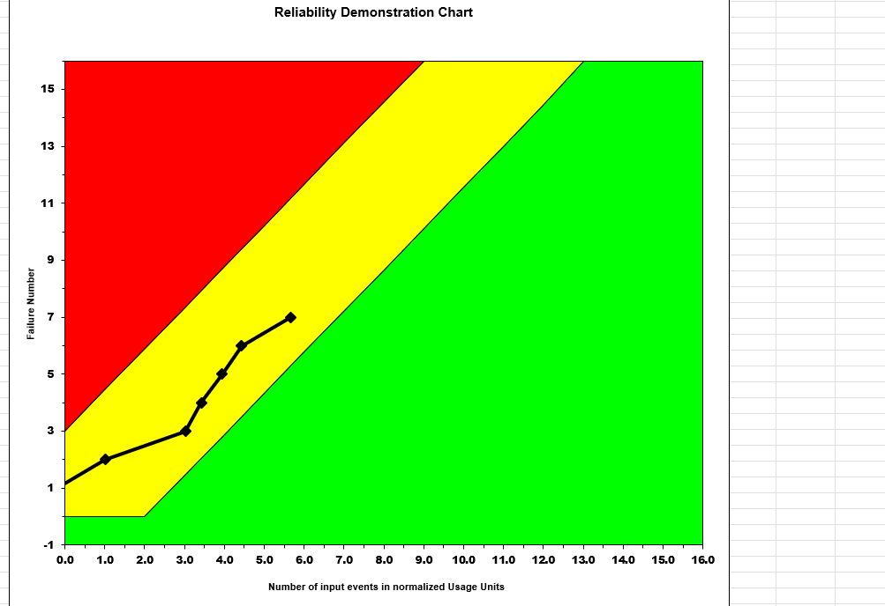

**SENG 438- Software Testing, Reliability, and Quality**

**Lab. Report \#5 – Software Reliability Assessment**

| Group \#:     2  |   |
|-----------------|---|
| Student Names:  |   |
|            Said Rahmani     |   |
|            Qasim Amar     |   |
|              Ahmed Abdullah
Muhammad Bilal   |   |

# Introduction

# 

# Assessment Using Reliability Growth Testing 

# Assessment Using Reliability Demonstration Chart 

The above image displays the plot for MTTFmin. The reliability trend displayed shows it partially in the reject area so it doesn't seem very reliable for FIO. The calculation for MTTF, in this case, is 16/286,560, which gives an MTTF of 0.000055.

The above image displays the plot for MTTFhalf. The reliability trend displayed shows it in the reject area so it doesn't seem reliable at all for FIO. The calculation for MTTF, in this case, is 8/286,560, which gives an MTTF of 0.000028.

The above image displays the plot for MTTFdouble. As plotted, the reliability trend suggests that the trend is acceptable for our FIO as it can be seen clearly that it isnt in the reject range. The calculation for MTTF, in this case, is 32/286,560, which gives an MTTF of 0.0001.

# Explain your evaluation and justification of how you decide on the MTTFmin
We calculated our MTTFmin using our sum of time until failiiure divided by each 

# Comparison of Results

# Discussion on Similarity and Differences of the Two Techniques

# Discussion on Similarity and Differences of the Two Techniques

# How the team work/effort was divided and managed
We divided the assignment between pairs of two. The first pair was responsible for doing part 1 which was the reliability growth testing and the other pair worked on part 2 which was the reliability demonstration chart. Upon completion we got together and showed our progress and explained what we did so everyone could leave with an understanding for the whole assignment. Lastly, the report was worked on by all team members in order for equal contribution.

# Difficulties encountered, challenges overcome, and lessons learned
Upon starting the assignment we had to overcome some difficulties as it was pretty confusing to begin with. Just understanding the datasets and how to use the tools took time to understand but with some trial and error we were able to complete the tasks. Since one of the group members had a Mac we made sure to join calls so they could still contribute and learn. 

Overall we were able to learn how to use software tools to read intensity and reliabilty graphs and visualize the reliability of a system.

# Comments/feedback on the lab itself
The biggest issue we saw with the lab was a lack of intstructions on how to use the tools. A lot of time went into trying to figure out how to use the new tools without much clarity. Having to go back and forth between adjusting the dataset took time. With the use of the tools, multiple sets of graph were generated and having some instructions on how to interpret those graphs would have been helpful.
